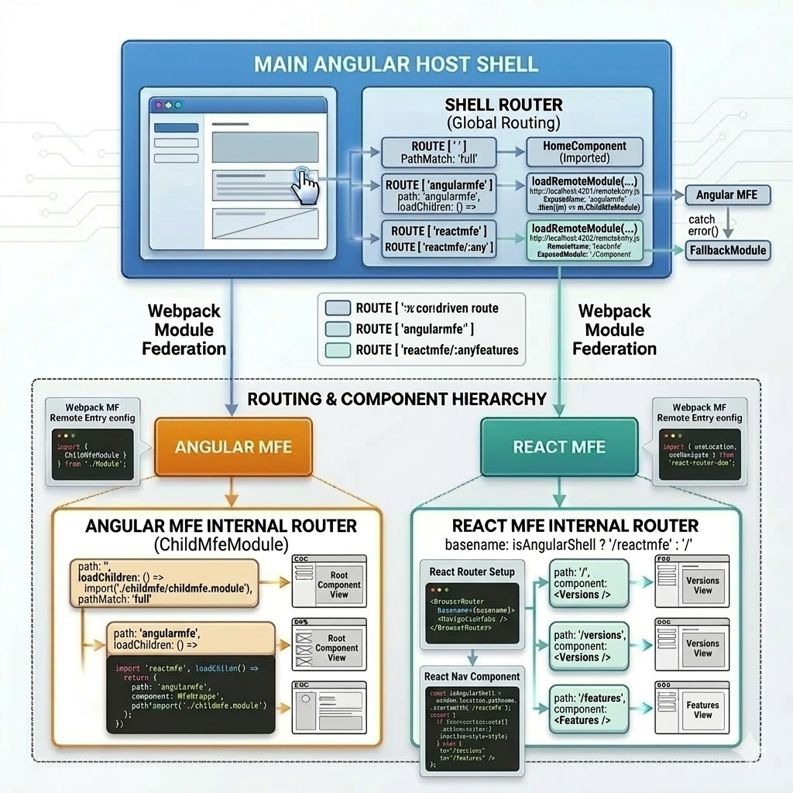
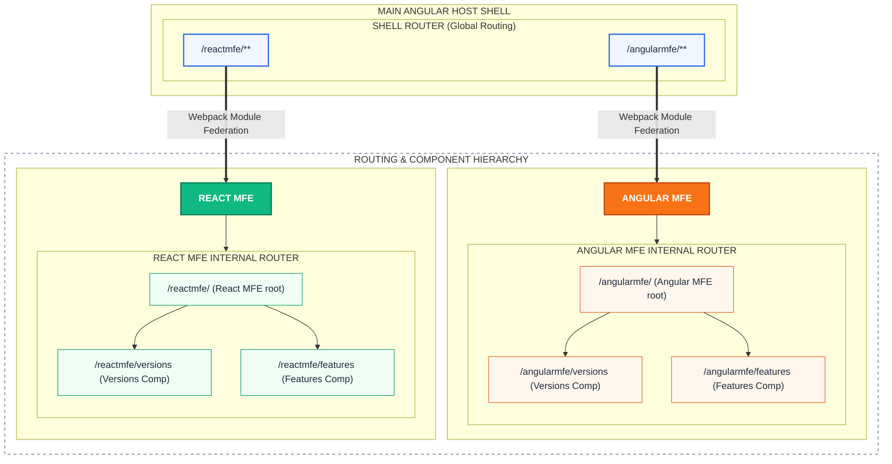

#  Multi-Framework Micro-Frontends (Angular + React)





Welcome to my micro-frontend playground! 

I built this project to experiment with running **Angular and React together** under the same roof using **Webpack Module Federation**. Having worked with different frameworks over the years, I wanted to seamlessly integrate them into a unified shell application and demonstrate how easy it is to mix and match technologies.

##   Architecture Overview

Here is the breakdown of the setup:
- **Host (Shell)**: Built with Angular. Orchestrates routing, navigation, and layout.
- **Angular Remote**: An Angular-based micro-frontend that plugs directly into the host.
- **React Remote**: A React app with a sleek dashboard, exposed as a micro-frontend.

Everything communicates via Webpack Module Federation, sharing dependencies where possible to keep the bundle size optimized and performance snappy.

##  How to Run It Locally

If you want to spin this up on your machine, it's pretty straightforward.

### 1. Install Dependencies
You'll need to run `npm install` inside each of the individual workspaces:
```bash
cd master && npm install
cd ../angularmfe && npm install
cd ../reactmfe && npm install
```

*(Tip: I usually just open 3 terminal tabs to do this quickly!)*

### 2. Start the Apps
You can start them individually if you like, but to make life easier, I added a script in the `master` app:

```bash
cd master
npm run start:all
```

This spins up:
- The **Angular Host** on `http://localhost:4200`
- The **Angular Remote** on `http://localhost:4201`
- The **React Remote** on `http://localhost:4202`

Simply open up `http://localhost:4200` and you'll see the magic working. 

##  Why am I sharing this?

Micro-frontends are often talked about but rarely shown with practical, multi-framework examples in a single repository. I wanted to create an easy-to-understand boilerplate so folks can explore how Module Federation actually works in the wild, without getting bogged down by extreme complexity.

Feel free to break things, fork it, and adapt it to your own needs! If you find it helpful or have questions, let me know on LinkedIn https://www.linkedin.com/in/binurajek/.
